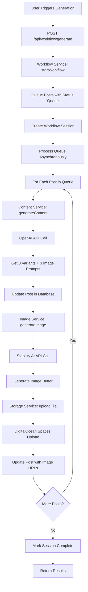
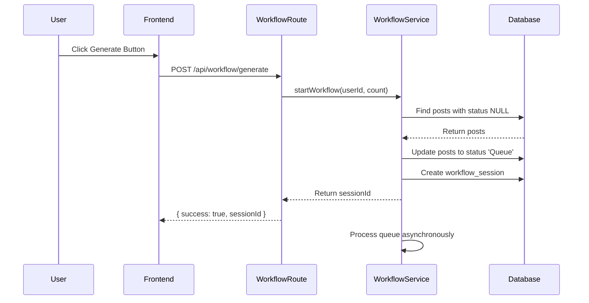
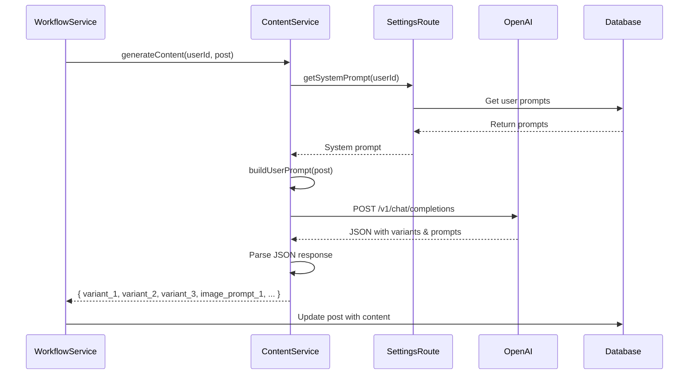
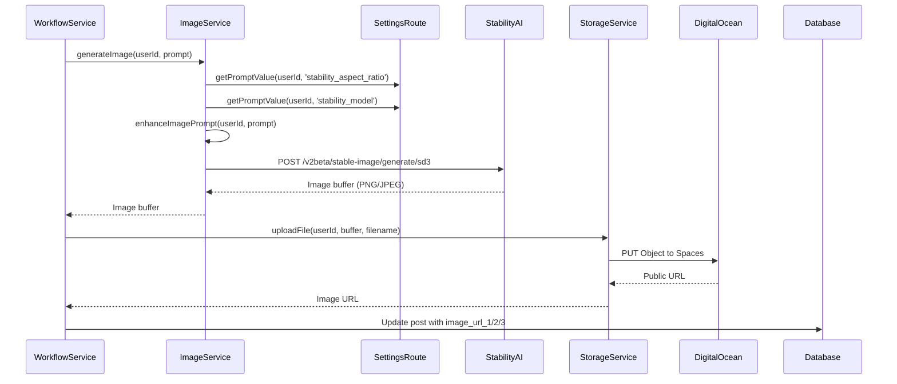
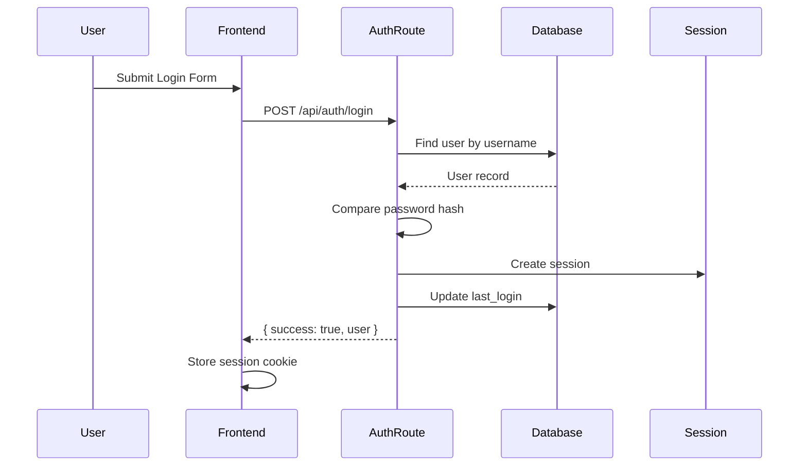
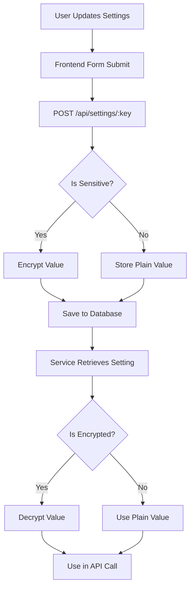
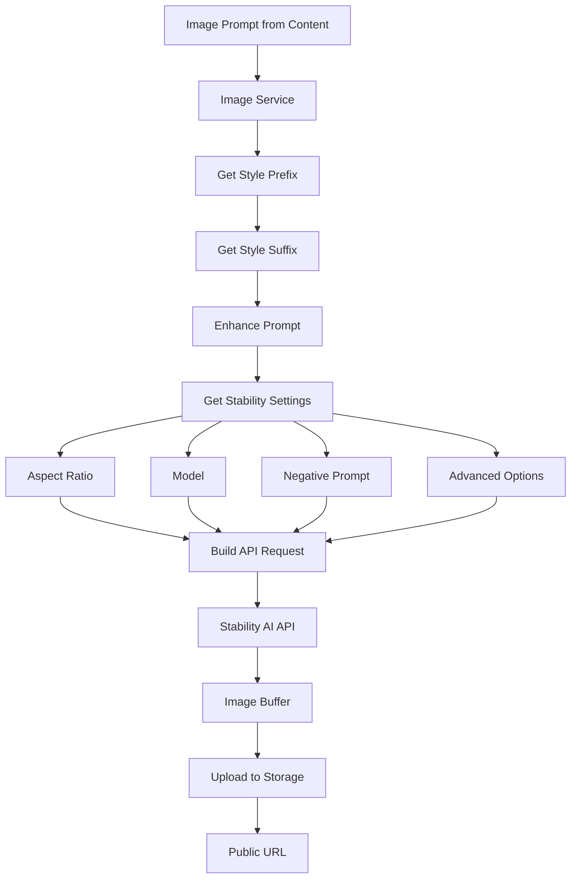

# SLOP Backend Architecture & Workflow

This document provides a comprehensive overview of the SLOP (Social LinkedIn Output Platform) backend architecture, data flow, and implementation details.

## Table of Contents

1. [System Overview](#system-overview)
2. [Architecture Components](#architecture-components)
3. [Content Generation Workflow](#content-generation-workflow)
4. [Database Schema](#database-schema)
5. [API Routes](#api-routes)
6. [Services](#services)
7. [Authentication & Security](#authentication--security)
8. [Data Flow Diagrams](#data-flow-diagrams)

---

## System Overview

SLOP is a Node.js-based application that automates LinkedIn content generation using AI services. It replaces the original N8N workflow with an internal Node.js service that orchestrates content and image generation.

### Key Technologies

- **Runtime**: Node.js with Express.js
- **Database**: SQLite (via `better-sqlite3`)
- **AI Services**: 
  - OpenAI GPT-4o (text generation)
  - Stability AI (image generation)
- **Storage**: DigitalOcean Spaces (S3-compatible)
- **Authentication**: Session-based with bcrypt password hashing

---

## Architecture Components

### Core Services

1. **Content Service** (`src/services/contentService.js`)
   - Generates LinkedIn post content using OpenAI
   - Creates 3 text variants per post
   - Generates 3 image prompts per post

2. **Image Service** (`src/services/imageService.js`)
   - Generates images using Stability AI
   - Applies customizable style prefixes/suffixes
   - Handles aspect ratios, models, and generation parameters

3. **Workflow Service** (`src/services/workflowService.js`)
   - Orchestrates the complete generation pipeline
   - Manages queue processing
   - Tracks workflow sessions

4. **Storage Service** (`src/services/storageService.js`)
   - Handles file uploads to DigitalOcean Spaces
   - Manages image storage and retrieval
   - Provides public URLs for generated content

5. **LinkedIn Service** (`src/services/linkedInService.js`)
   - Manages LinkedIn post scheduling
   - Handles post publishing
   - Tracks scheduled content

---

## Content Generation Workflow

### High-Level Flow



### Detailed Step-by-Step Process

#### 1. Workflow Initiation



#### 2. Content Generation



#### 3. Image Generation



---

## Database Schema

### Core Tables

#### `users`
- `id` (INTEGER PRIMARY KEY)
- `username` (TEXT UNIQUE)
- `email` (TEXT)
- `password_hash` (TEXT)
- `display_name` (TEXT)
- `role` (TEXT: 'user' | 'admin')
- `created_at` (TIMESTAMP)
- `last_login` (TIMESTAMP)

#### `posts`
- `id` (INTEGER PRIMARY KEY)
- `post_id` (TEXT UNIQUE) - External identifier
- `user_id` (INTEGER) - Foreign key to users
- `instruction` (TEXT)
- `type` (TEXT)
- `template` (TEXT)
- `purpose` (TEXT)
- `sample` (TEXT)
- `keywords` (TEXT)
- `variant_1`, `variant_2`, `variant_3` (TEXT) - Generated content
- `image_prompt_1`, `image_prompt_2`, `image_prompt_3` (TEXT)
- `image_url_1`, `image_url_2`, `image_url_3` (TEXT)
- `status` (TEXT: NULL | 'Queue' | 'generated' | 'scheduled' | 'rejected')
- `created_at` (TIMESTAMP)
- `updated_at` (TIMESTAMP)

#### `settings`
- `id` (INTEGER PRIMARY KEY)
- `user_id` (INTEGER) - Foreign key to users
- `key` (TEXT) - Setting key (e.g., 'openai_api_key')
- `value` (TEXT) - Encrypted or plain value
- `encrypted` (INTEGER: 0 | 1)
- `updated_at` (TIMESTAMP)
- UNIQUE(user_id, key)

#### `prompts`
- `id` (INTEGER PRIMARY KEY)
- `user_id` (INTEGER) - Foreign key to users
- `key` (TEXT) - Prompt key (e.g., 'content_system_prompt')
- `value` (TEXT) - Prompt content
- `updated_at` (TIMESTAMP)
- UNIQUE(user_id, key)

#### `workflow_sessions`
- `id` (INTEGER PRIMARY KEY)
- `session_id` (TEXT UNIQUE) - UUID
- `status` (TEXT: 'pending' | 'processing' | 'completed' | 'failed')
- `total_posts` (INTEGER)
- `processed_posts` (INTEGER)
- `error_message` (TEXT)
- `started_at` (TIMESTAMP)
- `completed_at` (TIMESTAMP)

---

## API Routes

### Authentication Routes (`src/routes/auth.js`)

- `POST /api/auth/login` - User login
- `POST /api/auth/logout` - User logout
- `GET /api/auth/me` - Get current user
- `POST /api/auth/register` - Register new user (admin only)

### Posts Routes (`src/routes/posts.js`)

- `GET /api/posts` - List posts (with filters)
- `GET /api/posts/:id` - Get single post
- `POST /api/posts` - Create new post
- `PUT /api/posts/:id` - Update post
- `DELETE /api/posts/:id` - Delete post
- `GET /api/posts/generated` - Get generated posts
- `GET /api/posts/scheduled` - Get scheduled posts
- `GET /api/posts/rejected` - Get rejected posts
- `GET /api/posts/generation-status` - Check generation status

### Workflow Routes (`src/routes/workflow.js`)

- `POST /api/workflow/generate` - Start generation workflow
- `POST /api/workflow/queue` - Queue posts manually
- `GET /api/workflow/status` - Get generation status
- `GET /api/workflow/session/:sessionId` - Get session status
- `POST /api/workflow/cancel/:sessionId` - Cancel workflow
- `GET /api/workflow/stats` - Get environmental impact stats
- `GET /api/workflow/history` - Get workflow history

### Settings Routes (`src/routes/settings.js`)

- `GET /api/settings` - Get all settings
- `GET /api/settings/:key` - Get specific setting
- `PUT /api/settings/:key` - Update setting
- `POST /api/settings/bulk` - Update multiple settings
- `GET /api/settings/prompts` - Get all prompts
- `PUT /api/settings/prompts/:key` - Update prompt
- `POST /api/settings/prompts/:key/reset` - Reset prompt to default
- `POST /api/settings/test/:service` - Test API connection

### Users Routes (`src/routes/users.js`)

- `GET /api/users` - List users (admin only)
- `GET /api/users/:id` - Get user details
- `POST /api/users` - Create user (admin only)
- `PUT /api/users/:id` - Update user
- `DELETE /api/users/:id` - Delete user (admin only)

---

## Services

### Content Service (`src/services/contentService.js`)

**Purpose**: Generate LinkedIn post content using OpenAI GPT-4o

**Key Functions**:
- `generateContent(userId, post)` - Main generation function
- `getSystemPrompt(userId)` - Get customizable system prompt
- `buildUserPrompt(userId, post)` - Build user prompt from template
- `getImageStylePrompt(userId)` - Get image style modifiers

**Process**:
1. Retrieves user's system prompt (customizable)
2. Builds user prompt from post data using template
3. Calls OpenAI API with GPT-4o model
4. Parses JSON response with 3 variants and 3 image prompts
5. Returns structured content object

**OpenAI API Call**:
```javascript
{
  model: 'gpt-4o',
  messages: [
    { role: 'system', content: systemPrompt },
    { role: 'user', content: userPrompt }
  ],
  temperature: 0.8,
  max_tokens: 4000,
  response_format: { type: 'json_object' }
}
```

**Response Format**:
```json
{
  "variant_1": "...",
  "variant_2": "...",
  "variant_3": "...",
  "image_prompt_1": "...",
  "image_prompt_2": "...",
  "image_prompt_3": "..."
}
```

### Image Service (`src/services/imageService.js`)

**Purpose**: Generate images using Stability AI

**Key Functions**:
- `generateImage(userId, prompt, options)` - Main generation function
- `enhanceImagePrompt(userId, prompt)` - Add style prefixes/suffixes

**Process**:
1. Retrieves user's Stability AI settings (aspect ratio, model, etc.)
2. Enhances prompt with style prefixes/suffixes
3. Calls Stability AI API
4. Returns image buffer

**Stability AI API Call**:
```javascript
POST https://api.stability.ai/v2beta/stable-image/generate/sd3
Headers: {
  'Authorization': `Bearer ${apiKey}`,
  'Accept': 'image/png' or 'image/jpeg'
}
Body: {
  prompt: enhancedPrompt,
  aspect_ratio: '1:1' | '16:9' | '9:16' | '4:3' | '3:4',
  model: 'sd3-large-turbo' | 'sd3' | 'stable-diffusion-xl-1024-v1-0',
  output_format: 'png' | 'jpeg',
  negative_prompt: '...',
  seed: number (optional),
  steps: number (optional),
  cfg_scale: number (optional)
}
```

### Workflow Service (`src/services/workflowService.js`)

**Purpose**: Orchestrate the complete generation pipeline

**Key Functions**:
- `startWorkflow(userId, postCount)` - Start new workflow session
- `queuePosts(userId, count)` - Queue posts for processing
- `processQueue(userId, sessionId)` - Process queued posts
- `getSessionStatus(sessionId)` - Get workflow status
- `isGenerationInProgress()` - Check if generation is running

**Workflow Steps**:
1. **Queue Phase**: Find posts with `status IS NULL`, update to `'Queue'`
2. **Session Creation**: Create workflow session record
3. **Processing Loop**: For each queued post:
   - Generate content (3 variants + 3 image prompts)
   - Update post with content
   - Generate 3 images
   - Upload images to storage
   - Update post with image URLs
   - Update post status to `'generated'`
4. **Session Completion**: Mark session as completed

**Error Handling**:
- Failed posts are reset to `status NULL`
- Errors are logged in session record
- Processing continues for remaining posts

### Storage Service (`src/services/storageService.js`)

**Purpose**: Handle file uploads to DigitalOcean Spaces

**Key Functions**:
- `uploadFile(userId, fileBuffer, fileName, options)` - Upload single file
- `createUploader(userId)` - Create uploader function for workflow
- `saveAdditionalImages(userId, postId, files)` - Save extra images

**Process**:
1. Retrieves user's DigitalOcean Spaces credentials
2. Creates S3 client configured for Spaces
3. Uploads file buffer to Spaces bucket
4. Returns public URL

**DigitalOcean Spaces Configuration**:
- Endpoint: `{region}.digitaloceanspaces.com`
- Access via AWS SDK (S3-compatible API)
- Public URLs: `https://{spaces_name}.{region}.cdn.digitaloceanspaces.com/{path}`

---

## Authentication & Security

### Authentication Flow



### Security Features

1. **Password Hashing**: bcrypt with salt rounds
2. **Session Management**: Express-session with secure cookies
3. **API Key Encryption**: Sensitive settings encrypted at rest
4. **Authentication Middleware**: `requireAuth` on protected routes
5. **Role-Based Access**: Admin vs. user permissions

### Sensitive Settings

The following settings are encrypted:
- `openai_api_key`
- `stability_api_key`
- `spaces_key`
- `spaces_secret`
- `google_drive_service_account`
- `google_client_secret`

---

## Data Flow Diagrams

### Complete Generation Pipeline

```mermaid
graph LR
    A[Post Created] --> B[Status: NULL]
    B --> C[User Triggers Generation]
    C --> D[Status: Queue]
    D --> E[Workflow Starts]
    E --> F[Content Generation]
    F --> G[OpenAI API]
    G --> H[3 Variants + 3 Prompts]
    H --> I[Image Generation]
    I --> J[Stability AI API]
    J --> K[3 Image Buffers]
    K --> L[Upload to Spaces]
    L --> M[3 Image URLs]
    M --> N[Status: generated]
    N --> O[User Reviews]
    O --> P{User Action}
    P -->|Approve| Q[Status: scheduled]
    P -->|Reject| R[Status: rejected]
```



### Settings & Configuration Flow



### Image Generation with Style Enhancement



---

## Error Handling

### Workflow Error Handling

- **Content Generation Failure**: Post status reset to NULL, error logged
- **Image Generation Failure**: Image URL set to NULL, processing continues
- **Storage Upload Failure**: Error logged, post may have partial images
- **API Rate Limits**: Implemented delays between requests (1.5s for images)

### Database Transactions

- Workflow sessions use transactions for atomic updates
- Post status changes are atomic
- Settings updates use UPSERT pattern

---

## Performance Considerations

1. **Asynchronous Processing**: Workflow runs in background
2. **Rate Limiting**: Delays between API calls to avoid limits
3. **Database Indexing**: Indexes on `user_id`, `status`, `post_id`
4. **Session Tracking**: Progress updates for long-running workflows
5. **Error Recovery**: Failed posts can be retried

---

## Future Enhancements

- Webhook support for external integrations
- Batch processing optimizations
- Image caching and CDN integration
- Advanced retry mechanisms
- Real-time progress updates via WebSockets

---

## Conclusion

The SLOP backend provides a robust, scalable architecture for automated LinkedIn content generation. The modular service design allows for easy maintenance and extension, while the workflow orchestration ensures reliable processing of content generation tasks.

For questions or contributions, please refer to the main README.md file.
